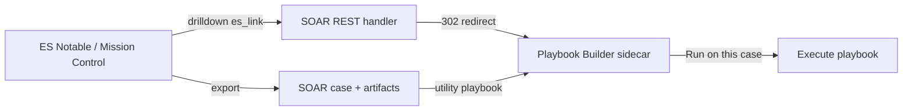

# ES ↔ SOAR ↔ Playbook Builder — stitching guide

This guide connects **Splunk Enterprise Security (ES)** investigations to the **SOAR Playbook Builder** sidecar so analysts can jump from a notable to build/import/run playbooks on the linked case.

## Architecture



| Entry point | When to use |
|-------------|-------------|
| **ES drilldown → `es_link`** | From Incident Review / Mission Control while triaging |
| **Utility playbook** | From an existing SOAR case (after ES export or manual case) |
| **Manual URL** | Demos, bookmarks, scripts |

---

## Prerequisites

1. **SOAR Playbook Builder app** v2.14.0+ installed
2. **Playbook Builder asset** created (note the asset name, e.g. `playbook_builder`)
3. **Handler URL** — run from the app directory:

   ```bash
   ./scripts/print_sidecar_url.sh
   ```

   You need:
   - `SOAR_URL` — base URL (e.g. `https://soar.example.com`)
   - `DIRECTORY` — e.g. `soarplaybookbuilder_<uuid>`
   - `ASSET` — your asset name

---

## 1. ES drilldown (recommended for ES → Builder)

The app exposes a redirect route that accepts ES context, **looks up the SOAR case** when `event_id` is present, and opens the builder with the right query params.

### URL pattern

```
https://<SOAR_HOST>/rest/handler/<DIRECTORY>/<ASSET>/es_link?event_id=$event_id$&rule_name=$rule_name$
```

Optional params: `container_id`, `playbook_id`, `investigation_id`

JSON variant (no redirect): append `&format=json`

### Add in ES

1. **Settings → Content Management → Event Investigations → Drilldowns** (path varies slightly by ES version)
2. Create drilldown **Open Playbook Builder**
3. Set link type **External** and paste your URL (replace placeholders):

   ```
   https://SOAR_HOST/rest/handler/soarplaybookbuilder_UUID/playbook_builder/es_link?event_id=$event_id$&rule_name=$rule_name$
   ```

4. Scope to notables / investigations as needed

### What happens

| ES export state | Behavior |
|-----------------|----------|
| Notable **already exported** to SOAR | `es_link` finds the case by `event_id` in artifacts → sidecar shows **Case ID** → **Run on this case** works after import |
| Notable **not yet** in SOAR | Sidecar opens with `event_id` + `rule_name` → template suggestion works; link a case later via utility playbook or re-open after export |

Example drilldown definition: `es_content/drilldown_playbook_builder.json`

---

## 2. Utility playbook (SOAR case → Builder)

Shipped in this repo — one-click from any case.

### Install

```bash
cd packaging/soar-playbook-builder-app
python3 utility_playbooks/package_utility_playbooks.py
# → dist/open_playbook_builder.tgz

# SOAR → Playbooks → Import → open_playbook_builder.tgz
```

### Configure

Edit `BUILDER_ASSET` at the top of `utility_playbooks/open_playbook_builder.py` **before** packaging, or re-import after editing on SOAR:

```python
BUILDER_ASSET = "playbook_builder"  # your asset name
```

### Run

1. Open a **case** in SOAR
2. **Playbooks** tab → **Open Playbook Builder** → Run
3. Open the URL from the **case note**
4. Build → Import → **Run on this case**

Optional: add **Open Playbook Builder** to case **Response Plans** or run automatically when ES export creates cases (advanced).

---

## 3. Mission Control round-trip

From Mission Control, ES drilldown uses the same `es_link` URL with `event_id`.

To return from SOAR to ES investigation (manual today):

```
https://<ES_HOST>/en-US/app/SplunkEnterpriseSecuritySuite/ess_investigation?event_id=<EVENT_ID>
```

The sidecar header shows `event_id` when passed — copy it for the ES link.

---

## 4. End-to-end lab flow (Failed Logins example)

1. **ES** — trigger or find a Failed Logins notable; note `event_id` and `rule_name`
2. **ES → SOAR** — export notable (Incident Review integration) → SOAR case created
3. **ES drilldown** — click **Open Playbook Builder** → sidecar opens with case + rule context
4. **NL prompt** (example):  
   *When a case is high or critical severity, post an alert to #soc-alerts with the case name and severity.*
5. **Readiness** → **Import to SOAR** → **Run on this case**
6. Verify Slack / actions on the case

---

## 5. SOAR custom navigation (optional)

Some SOAR versions support **custom links** on the case page. Add a static template:

```
/rest/handler/<DIRECTORY>/<ASSET>/es_link?container_id={container.id}
```

(Exact macro syntax depends on your SOAR version — check Administration → System Settings → Navigation.)

---

## Troubleshooting

| Issue | Fix |
|-------|-----|
| 404 on `es_link` | Reinstall app v2.14.0+; confirm URL uses correct `directory` from `print_sidecar_url.sh` |
| Sidecar opens but no **Case** in header | Notable not exported yet, or `event_id` not in artifacts — run utility playbook from case instead |
| Utility playbook fails | Set `BUILDER_ASSET` to your asset name; test **get sidecar url** action on the asset |
| ES drilldown blank | ES token `$event_id$` must match your notable field; test URL manually with a real event_id |
| Template not suggested | Pass `rule_name` in URL; check `investigation_context` in browser devtools |

4. Optional: set **`es_web_url`** on the asset (e.g. `https://es.example.com:8000`) for **Back to Mission Control** in the sidecar header.

---

## 6. Auto-run Open Playbook Builder on ES export

See [RESPONSE_PLAN_OPEN_BUILDER.md](RESPONSE_PLAN_OPEN_BUILDER.md) — response plan runs the utility playbook when a new case is created from ES export.

---

## Related docs

- [PLAYBOOK_BUILDER_GUIDE.md](PLAYBOOK_BUILDER_GUIDE.md) — sidecar basics
- [FAILED_LOGINS_QUICK_START.md](FAILED_LOGINS_QUICK_START.md) — ES export pairing
- [EXAMPLE_WALKTHROUGHS.md](EXAMPLE_WALKTHROUGHS.md) — container-aware URLs
