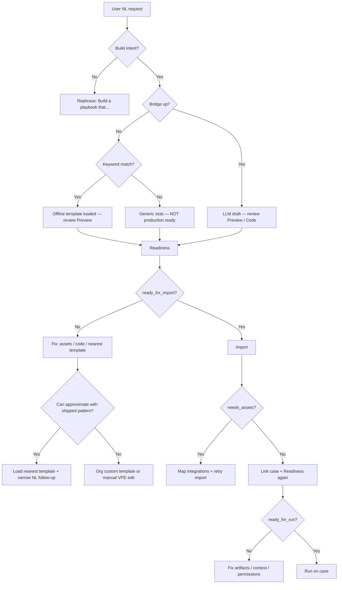

# Natural language testing & recovery loop

Hands-on guide for **testing Playbook Builder NL behavior** and a **repeatable recovery process** when the builder cannot fulfill a request — unsupported integrations, missing case context, bridge offline, import blocked, or run failures.

Use this for QA before GitHub release, customer pilots, and operator training.

**Related:** [EXAMPLE_WALKTHROUGHS.md](./EXAMPLE_WALKTHROUGHS.md) · [TROUBLESHOOTING.md](./TROUBLESHOOTING.md) · [DEMO_AND_NL_ENV.md](./DEMO_AND_NL_ENV.md) · [ARCHITECTURE.md](./ARCHITECTURE.md) · [E2E_VALIDATION.md](./E2E_VALIDATION.md)

---

## Who this is for

| Role | Use this doc to… |
|------|------------------|
| **QA / release engineer** | Sign off NL paths (Mode A stub, Mode A keyword match, Mode B LLM) before publish |
| **SOC analyst** | Know what to do when chat returns a stub or import/run fails |
| **Platform engineer** | Extend templates, asset defaults, or org custom templates when NL outruns the catalog |

---

## Sidecar navigation (Build · Run · Help)

Primary navigation is the **Build**, **Run**, and **Help** tabs at the top of the sidecar.

| UI element | Where shown | Purpose |
|------------|-------------|---------|
| **Build / Run / Help** tabs | All pages | Switch workspace: author, run-on-case, help & troubleshooting |
| **Workflow strip** (Template → Preview → Import → Run) | **Build tab only** | Progress through scaffold → preview → import; hidden on Run/Help to avoid confusion with tab navigation |

Use **Build** to chat, preview, and import. Use **Run** to link a case and execute (preview remains in the right column). Use **Help** for step-by-step guidance, **demo data walkthrough**, **NL recovery loop**, and searchable troubleshooting.

The in-app Help tab mirrors this doc’s recovery flowchart and demo sample catalog; see also [RUN_TAB_DEMO.md](./RUN_TAB_DEMO.md).

---

## How NL is processed (decision order)

When a user sends a message on the **Build** tab, the SOAR connector applies this order:

1. **Explicit commands** — `scaffold <pattern>`, `pattern <pattern>`, `validate current preview`
2. **Local keyword match (build intent)** — offline template scaffold when keywords hit a known pattern (fast; no MCP)
3. **MCP bridge** — `POST {mcp_bridge_url}/api/chat` with container/playbook context (Mode B)
4. **Offline fallback** — keyword match → full template; no match but build intent → **generic stub** (`pattern: nl-generated`); not build intent → error

**Mode A pill:** *Templates only* — steps 2 and 4 only.  
**Mode B pill:** *AI connected* — step 3 attempted first for open-ended chat; falls back to 4 on bridge failure.

See [ARCHITECTURE.md](./ARCHITECTURE.md) and [MCP_INTEGRATION.md](./MCP_INTEGRATION.md) for full detail.

### Build intent (offline)

A message is treated as “build a playbook” when it includes a build verb (`build`, `create`, `generate`, …) plus a playbook noun (`playbook`, `workflow`, …), **or** is long enough (≥8 words), **or** starts with `scaffold `. Messages starting with `explain `, `lesson `, or `quiz ` are **not** build intent and will not get an offline stub.

Implementation: `soar_playbook_builder/local_nl_build.py`.

### Generic offline stub

When MCP is unavailable and no keyword matches, the builder returns a minimal playbook (collect + note) with:

- `pattern: nl-generated`
- `offline_mode: true`
- `llm_fallback: true`

The sidecar shows a warning: *LLM unavailable — placeholder stub only*. This is **not production-ready** — it confirms NL routing works, not that the requested integration exists.

---

## Reference test prompt (outside the template catalog)

Use this prompt to stress-test **unsupported integrations** and **approval gates**. None of the shipped scaffolds cover PagerDuty, Microsoft Teams, or analyst approval workflows.

> **Build a playbook that creates a PagerDuty incident when a critical ES notable fires, posts a summary to Microsoft Teams, and holds execution until an analyst approves in the case before running any containment actions.**

### Why this prompt is useful

| Expectation | Mode A (offline) | Mode B (bridge up) |
|-------------|------------------|---------------------|
| Keyword match to shipped template | Unlikely | N/A |
| Preview content | Generic stub or partial LLM draft | Custom Python possible |
| Import | May succeed structurally | Same |
| Asset preflight | Likely **needs_assets** (PagerDuty, Teams) | Same |
| Run on case | Requires linked container + imported playbook | Same |

### Other prompts that should **not** keyword-match offline

Use these for regression testing:

1. *Build a playbook that disables the user in Azure AD and revokes OAuth tokens when Microsoft Defender flags impossible travel.*
2. *Create a response workflow that posts to Microsoft Teams, opens a Jira ticket, and waits for analyst approval before unblocking the IP on Fortinet.*
3. *Build a playbook with three branches: if geo is embargoed country quarantine in Cisco ISE, elif hash score > 80 submit to sandbox, else auto-close and email the owner.*

### Recovery prompt (sanity check — should match offline)

After testing the hard prompt, confirm NL routing with a known integration:

> **Build a playbook that opens a ServiceNow P1 incident and adds a case note with the notable rule name and source IP.**

Expected offline match: **`servicenow-incident`** (or similar keyword hit). If this fails, fix environment/app version before debugging exotic prompts.

---

## Step-by-step test walkthrough (~15–20 min)

### Step 0 — Baseline

1. Open sidecar → **Build** tab.
2. Note header pill: **AI connected** vs **Templates only**.
3. Open **environment menu** → review bridge status and asset defaults.

### Step 1 — Submit the reference prompt

1. Paste the PagerDuty/Teams/approval prompt in **Natural language** (or chat).
2. Click **Build**.
3. Review **Chat** and **Preview → Blocks** / **Code**.

| Mode | Expected |
|------|----------|
| Offline | Stub + offline/LLM warning banners |
| AI connected | Custom draft; may reference apps not in your SOAR |

### Step 2 — Readiness (pre-import gate)

Click **Readiness** on Build or Run.

| Readiness item ID | Meaning | User action |
|-------------------|---------|-------------|
| `container_missing` | No `container_id` in URL | OK for import; **Run on case** blocked until case linked |
| `no_artifacts` | Linked case has no artifacts/datapaths | Link case from ES drilldown or provision demo case with artifacts |
| Integration / asset warnings | Scaffold references unmapped apps | Map in Integration panel or set `asset_defaults` on asset |
| Invalid Python / placeholders | Draft not import-safe | Edit code, re-scaffold from nearest template, or refine via chat (Mode B) |
| `ready_for_import: false` | Do not import yet | Fix items or **Apply auto-fixes** when offered |

API: `action=readiness_check` (requires app **v2.18.0+**).

### Step 3 — Import

Click **Import to SOAR**.

| Result | Meaning | Next step |
|--------|---------|-----------|
| `needs_assets` | Missing connector assets | Complete Integration check panel → confirm import |
| `success` | Playbook in SOAR | **Open in SOAR** → verify VPE |
| `import_failed` | Python/VPE error | Help → Troubleshooting → `import_failed`; compare to working template |

### Step 4 — Run on case

1. **Run** tab → link a case (or **Create on SOAR** for org-permitted demo samples).
2. After import → **Run on this case**.

| Blocker | Where it surfaces |
|---------|-------------------|
| No case linked | Run tab Help |
| Playbook not imported | Run tab Help / sync status |
| Readiness not re-run with case | Run **Readiness** again with container linked |

---

## Iterative recovery loop (flowchart)

Use this loop whenever NL fails, data is missing, or import/run breaks:



---

## Recovery tiers (operator playbook)

### Tier 1 — Rephrase (30 seconds)

If chat returns nothing useful or “not build intent”:

- Start with **“Build a playbook that…”**
- Name **one** integration you actually have onboarded (Okta, ServiceNow, PANW, …)
- Avoid `explain …` / `how do I …` for scaffold generation (Q&A path; offline returns no stub)

### Tier 2 — Nearest template + narrow ask (~5 min)

When the request is valid but unsupported by catalog:

1. **Templates** → pick closest pattern (`es-notable-response`, `servicenow-incident`, etc.).
2. **Load template** → confirm Preview.
3. Mode B: follow-up in chat, e.g. *Add a decision block: only proceed if severity is critical.*
4. Mode A: import starter, finish in VPE or add **org custom template** (`custom_templates_json` on asset — see [CUSTOMIZATION.md](./CUSTOMIZATION.md)).

### Tier 3 — Environment fixes (~5–10 min)

| Symptom | Fix |
|---------|-----|
| Templates only / bridge errors | Fix `mcp_bridge_url`; curl bridge health **from SOAR server** |
| `Unknown POST action: readiness_check` | Reinstall app **≥ v2.18** |
| Okta / SNOW / PANW assets missing | Environment menu → **Fix environment** or map `asset_defaults` |
| No case for run | ES drilldown into sidecar, or Run → link/create case |
| Empty datapaths / `no_artifacts` | Case needs artifacts; use ES export or demo provisioning per org policy |
| Sidecar blank / 404 | [TROUBLESHOOTING.md](./TROUBLESHOOTING.md) → `sidecar_blank_404` |

### Tier 4 — Product gap (document & extend)

When the user’s workflow is legitimate but not in catalog:

1. Capture: prompt, bridge mode, Readiness output, import error, case ID.
2. Short-term: org **custom template** + NL keywords in `custom_templates_json`.
3. Long-term: add scaffold in `pattern_catalog.py` + keywords in `local_nl_build.py`; add troubleshooting entry if recurring.

---

## Gap handling reference

### Unsupported or ambiguous NL

| Situation | Behavior |
|-----------|----------|
| Not build intent | MCP may answer Q&A; offline → error, no stub |
| Build intent, no keyword, MCP offline | Generic stub (`nl-generated`) + warnings |
| Build intent, no keyword, MCP online | LLM may produce custom code (still subject to import gates) |
| Unknown pattern name | Error + troubleshooting `unknown_pattern` |

### Missing integrations

- **Before import:** `preflight_import` / asset preflight against scaffold keys
- **Blocked:** `status: needs_assets` → Integration panel
- **Auto-fix:** `apply_environment_fixes` / **Fix environment** when unambiguous asset names exist

### Missing case context

- **Readiness:** `container_missing`, `no_artifacts` warnings
- **Run:** requires `container_id` + imported `playbook_id` (demo mock `9001` only when mocks enabled in dev)

### Readiness vs Validate

| Action | Scope |
|--------|--------|
| **Validate** | Structural score on current draft — Python, callbacks, datapaths |
| **Readiness** | Draft + environment — integrations, placeholders, container/artifacts, auto-fixes |

---

## Shipped templates (offline keyword targets)

Eleven patterns ship in `pattern_catalog.py` (plus org templates via `custom_templates_json`):

| ID | Category | Integrations |
|----|----------|--------------|
| `hello` | Getting started | — |
| `failed-logins-okta` | Identity | okta |
| `okta-idp-response` | Identity | okta |
| `insider-threat-ad` | Identity | active_directory |
| `es-notable-response` | Splunk ES | — |
| `clearpass-quarantine` | Network/NAC | clearpass_cppm, splunk_enterprise |
| `panw-block-ip` | Network/NAC | panw, splunk_enterprise |
| `servicenow-incident` | ITSM | servicenow |
| `indicator-enrichment` | Enrichment | virustotalv3 |
| `virustotal-enrichment` | Enrichment | virustotalv3 |
| `phishing-enrichment` | Enrichment | — (stub) |

Keyword routing: `soar_playbook_builder/local_nl_build.py` (`PATTERN_KEYWORDS`).

---

## Test session record (copy/paste)

```
Date:
Tester:
SOAR URL:
App version:
Bridge: AI connected | Templates only

--- Prompt under test ---
[paste]

--- Results ---
Preview pattern id:
offline_mode / llm_fallback:
Readiness: ready_for_import ___  ready_for_run ___
Readiness item IDs:
Import: success | needs_assets | failed
Case ID:
Run: success | blocked (reason)

--- Recovery path used ---
Tier 1 / 2 / 3 / 4 — notes:

--- Pass/Fail ---
[ ] NL routing behaved as expected for mode
[ ] Readiness clearly stated gaps
[ ] Recovery prompt (ServiceNow) matched template offline
[ ] Import/run path documented for follow-up
```

---

## Suggested QA sequence (release checklist)

1. **Hard prompt** (PagerDuty/Teams/approval) → expect stub or `needs_assets`.
2. **Readiness** → record all item IDs.
3. **Recovery prompt** (ServiceNow P1) → expect real template in Mode A.
4. **Import** → map assets if prompted.
5. **Run** → link case → **Run on this case** (or document blockers).
6. **Help** tab → search symptoms hit (`needs_assets`, `container`, `bridge`, `readiness`).

For automated API-level checks, run [E2E_VALIDATION.md](./E2E_VALIDATION.md). This doc covers **operator-visible NL behavior** that E2E may not fully assert.

---

## Definition of success (this exercise)

You do **not** need PagerDuty or Teams working end-to-end. Success means:

- Builder **clearly distinguishes** stub vs keyword template vs LLM draft
- **Readiness** names missing assets, case, and artifacts
- Operators can **recover** via nearest template + environment fixes
- The **recovery loop** is repeatable for production gaps

---

## Code & catalog references

| Area | Path |
|------|------|
| Offline NL / stub | `soar_playbook_builder/local_nl_build.py` |
| Chat router | `soar_playbook_builder/playbook_builder_connector.py` |
| Patterns | `soar_playbook_builder/pattern_catalog.py` |
| Readiness | `soar_playbook_builder/playbook_readiness.py` |
| Troubleshooting catalog | `soar_playbook_builder/troubleshooting_catalog.py` |
| Sidecar Help UI | `sidecar-ui/src/components/HelpGuide.tsx` |

Runtime troubleshooting search: sidecar **Help** tab or `GET …/chat?action=troubleshoot&q=…` — see [TROUBLESHOOTING.md](./TROUBLESHOOTING.md).
