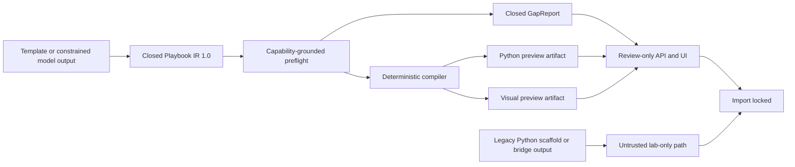

# Offline trusted-foundation implementation record

- **Implementation snapshot:** 2026-07-28
- **Base revision:** `13486a6` (`main`)
- **Development branch:** `codex/gate0-foundation`
- **Target repository:** `LeiterConsulting/soar-playbook-builder`
- **App version:** `2.27.0`
- **Release state:** engineering alpha; trusted Import and Run remain locked

This record consolidates the work completed without a live Splunk SOAR
instance. It explains what was implemented, what was tested, which legacy
surfaces were contained or retired, and which claims still require external
evidence.

The detailed normative contracts remain authoritative:

- [IR_CONTRACT.md](./IR_CONTRACT.md)
- [COMPILER_CONTRACT.md](./COMPILER_CONTRACT.md)
- [GAP_REPORT_CONTRACT.md](./GAP_REPORT_CONTRACT.md)
- [MODEL_BOUNDARY.md](./MODEL_BOUNDARY.md)
- [RETRIEVAL_CONTRACT.md](./RETRIEVAL_CONTRACT.md)
- [TRUSTED_REVIEW.md](./TRUSTED_REVIEW.md)
- [THREAT_MODEL.md](./THREAT_MODEL.md)
- [OFFLINE_READINESS.md](./OFFLINE_READINESS.md)
- [TRUSTED_RELEASE_PLAN.md](./TRUSTED_RELEASE_PLAN.md)

## 1. Resulting trust architecture



The trusted path accepts data, not executable model output. IR, reports, and
artifacts are canonicalized and hashed. An offline-clean report means only that
the supplied IR and evidence are internally consistent; it is not authorization
to mutate SOAR.

Every trusted review response therefore keeps:

```json
{
  "review_only": true,
  "import_enabled": false,
  "ready_for_import": false,
  "import_block_reason": "TRUSTED_IMPORT_DISABLED"
}
```

## 2. Implemented capability areas

| Area | Implementation | Evidence |
|---|---|---|
| Capability index | Extended schema, provenance, integrity metadata, explicit harvest state, locked atomic replacement, last-known-good recovery | Unit tests cover corruption, interrupted writes, partial harvest, concurrency, and reload |
| Playbook IR 1.0 | Closed typed graph, bindings, edges, metadata, bounded literals, allowlisted helpers, deterministic canonical JSON | JSON Schema and schema-derived GBNF, negative corpus, graph validation, canonical hash tests |
| Deterministic compiler | IR produces sibling Python and visual JSON artifacts with the same IR hash and node inventory | Golden artifacts, syntax/AST checks, parity, byte stability, tamper rejection, and lossless round trips |
| Preflight and GapReport | Closed action, asset, parameter, datapath, permission, object, egress, graph, and staleness checks | Exact expected gap sets across 40 cases and every deterministic gap ID |
| No-model corpus | Forty fixed, network-denied capability → IR → compiler → validator cases | 40/40 exact status and gap-ID match |
| Model boundary | Narrow OpenAI-compatible provider with TLS/address/redirect/size policy, constrained-output probe, duplicate-key-safe decode, authoritative provenance, and bounded repair | Scripted malformed JSON, hallucinated action, provider failure, oversize, timeout, certificate, and repair-exhaustion cases |
| Retrieval | Deterministic BM25 over local action metadata and canonical IR, bounded context, optional reciprocal-rank fusion without a required embedding dependency | Eleven templates dual-compile; fixed 20-intent top-5 action recall is 1.000; sockets denied |
| Organization templates | Strict bounded `custom_ir_templates_json` with duplicate-key protection, exact wrapper/IR/metadata ID binding, and metadata limits | Strict IR is reviewable; legacy Python is ignored unless the explicit lab flag is enabled |
| Trusted review | Stateless review actions return canonical IR, exact GapReport, provenance, compiler version, review ID, and artifact hashes | Clean and blocked API/UI tests; no route can consume review output as Import authority |
| Self-test | Canonical template parse/compile, trusted review lock, organization-config behavior, and capability/index checks | Connector and self-test unit coverage |

## 3. Security and privacy work

### Request and action policy

- Classified REST actions as read-only or mutating and rejected unsupported
  method/action combinations.
- Kept GET read-only and moved mutation selection to POST.
- Added bounded request parsing and content-type policy.
- Added stable public errors and response sanitization so tracebacks, secrets,
  tokens, and internal details do not enter browser/API responses.
- Added privacy-safe audit fields without treating caller-controlled headers as
  authenticated identity.
- Left principal/role authorization fail-closed for the future trusted mutation
  path because the required platform-authenticated signal must be observed on a
  live SOAR installation.

### Browser boundary

- Escaped HTML bootstrap values in their actual attribute context.
- Added CSP and defensive response headers: no-store, MIME-sniff protection,
  referrer policy, framing restriction, permissions policy, and cross-origin
  resource controls.
- Removed inline scripts and external font requests.
- Replaced React Router with a small typed native hash router, reducing the
  client dependency and advisory surface.
- Removed shared process-global trusted draft state.
- Kept syntax highlighting limited to the reviewed Highlight.js rendering
  boundary.

### Network transport

- Added centralized bridge URL validation for scheme, hostname, address class,
  credentials, fragments, and redirects.
- Enforced HTTPS/TLS verification by default with explicit custom-CA support.
- Kept plain HTTP and insecure TLS behind visible lab-only flags.
- Protected loopback SOAR REST calls with method/header policy, URL validation,
  response-size limits, and no redirects.
- Hardened live smoke tooling to require explicit credentials, same-origin
  HTTPS, bounded responses, and no redirect following.
- Added a Chromium test that fails on any external request in offline mock
  routes. This test found and fixed a protocol-relative logo URL that attempted
  an unintended DNS lookup from root-path development mode.

### Configuration and secrets

- Marked the SOAR REST token as a secret/password field.
- Permanently excluded secrets from asset configuration export/import.
- Bounded organization JSON configuration to 1 MiB and 128 entries.
- Rejected duplicate JSON keys and non-finite values in strict configuration
  and model boundaries.
- Added repository security policy and private vulnerability-reporting guidance.

## 4. Reliability and resilience work

- Atomic capability-index writes use a temporary file, validation, checksum,
  lock, replacement, and last-known-good recovery.
- Compiler, report, retrieval, and package outputs are deterministic for the
  same normalized input and build metadata.
- Invalid model, config, archive, and transport inputs return bounded,
  structured failures.
- Provider failure cannot change or import a draft.
- Archive construction normalizes order, ownership, permissions, gzip metadata,
  and timestamps.
- Archive inspection rejects traversal, links, special files, unsafe modes,
  credential-like names, oversized members, unexpected roots, and
  manifest/license drift.
- Root documentation is canonical. Package assembly copies declared files
  rather than maintaining a divergent source duplicate.

## 5. Legacy containment and technology changes

| Previous surface | Decision |
|---|---|
| SOAR 6 Python 2 / privileged `phenv` migration | Removed from the packaged app; the hidden legacy action returns a stable unsupported-operation error |
| Automatic overwrite/delete during Python 2 migration | Removed; legacy content is not mutated automatically |
| Executable organization Python templates | Replaced by strict IR; optional legacy compatibility is visibly untrusted and lab-only |
| Model-authored Python | Prohibited from the trusted compiler/import path |
| React Router | Removed; typed native hash navigation is sufficient for four routes |
| External web fonts | Removed to preserve offline behavior and reduce CSP/egress surface |
| Node 20 | Replaced by Node 24 LTS in `.nvmrc`, engines, CI, and release workflows |
| Hand-maintained packaged documentation copies | Removed; the package stages canonical root documents |
| Vite 6.4 | Retained temporarily because it still receives security backports; Vite 8 migration is isolated as a later compatibility change |
| React + TypeScript | Retained; they provide useful type, component, accessibility, and browser test boundaries |
| Standard-library runtime validation and HTTP | Retained to minimize the offline app dependency surface; policies are centralized and tested |

## 6. UI and accessibility work

- Added a dedicated trusted-IR review card with separate clean and blocked
  states, hashes/provenance disclosure, and a permanent Import lock.
- Added strict-IR and legacy-untrusted organization-template labels.
- Exposed organization parse errors and warnings to the UI.
- Added a semantic main landmark and keyboard-focusable live chat history.
- Fixed primary-button contrast for WCAG AA automated checks.
- Replaced the inert pre-import “Open in SOAR” anchor with a genuinely disabled
  button.
- Kept Import and Run disabled throughout trusted review.
- Added repeatable Vitest/Testing Library and axe structural tests.
- Added Chromium tests for:
  - clean Hello review;
  - blocked action review with `ASSET_UNBOUND`;
  - Build, Run, Help, and Coach routes;
  - full-page axe analysis;
  - 1024×768, 1280×720, and 1440×900 overflow behavior;
  - console and page errors;
  - unexpected external HTTP requests.

## 7. Secure development and release engineering

- Added SHA-pinned GitHub Actions for tests, audits, SAST, secret scanning,
  builds, documentation, packaging, and release artifacts.
- Added Dependabot configuration.
- Added full-history gitleaks CI and a local bounded credential-pattern check.
- Added exact Python tooling constraints and bounded Node engine ranges.
- Added `pip-audit`, `npm audit`, and Bandit gates.
- Added CycloneDX UI SBOM generation.
- Added release tag/manifest version enforcement and SHA-256 checksums.
- Aligned the manifest, repository, attribution, and packaged notices on the
  MIT license.
- Added third-party React, ReactDOM, and Highlight.js license files to the app
  archive.
- Advanced the coordinated manifest/UI/changelog version to `2.27.0`.

## 8. Verification snapshot

The final all-up offline verification produced:

| Check | Result |
|---|---:|
| Python tests | 275 passed |
| Evaluation suites | 7 passed |
| Exact no-model cases | 40/40 |
| Deterministic gap IDs seeded | 31/31 |
| Canonical IR templates | 11/11 parse and dual-compile |
| Retrieval corpus | top-5 action recall 1.000 |
| UI component/navigation tests | 7 passed |
| Chromium browser tests | 4 passed |
| Markdown link check | 39 files |
| Sidecar production build | passed |
| Validation-console production build | passed |
| Sidecar npm audit | 0 vulnerabilities |
| Validation-console npm audit | 0 vulnerabilities |
| Python dependency audit | no known vulnerabilities |
| Bandit high/medium gate | 0 findings |
| Package inspector | clean |
| Package reproducibility | two independent archives had identical SHA-256 |
| UI SBOM | CycloneDX 1.5 generated |

The reproducible install archive is generated locally with:

```bash
./package_app.sh
python3 scripts/inspect_app_archive.py dist/soar_playbook_builder.tgz
```

Release files under `dist/` are intentionally ignored by Git. The release
workflow rebuilds the app archive and UI SBOM from the committed source, checks
the tag against the manifest, creates `SHA256SUMS`, and attaches those files to
the GitHub release.

## 9. Claims intentionally deferred

The following cannot be established honestly from repository-only tests:

1. SOAR’s authenticated principal and role signals at the custom REST handler.
2. Session, origin, CSRF, and reverse-proxy behavior on the target deployment.
3. Exact supported-version REST contracts for apps, actions, assets,
   permissions, objects, playbooks, import, and run.
4. Native Visual Playbook Editor schema compatibility.
5. Clean install, upgrade, rollback, restart, and multi-worker behavior.
6. Actor-bound approval, commit-time hash revalidation, idempotent import,
   isolation, and protected audit logs.
7. Safe runtime behavior and expected outputs on disposable SOAR cases.
8. A named weakest local model/runtime and a 100+ domain-reviewed corpus.
9. Manual keyboard/screen-reader review and representative analyst usability.
10. Signed provenance, which requires a selected signing identity and release
    policy.

None of these deferred claims should be inferred from a green offline
GapReport.

## 10. Live-instance handoff order

When a non-production SOAR instance is available:

1. Build the archive from the committed branch and verify `SHA256SUMS`.
2. Install through the SOAR Apps UI; do not run a standalone Vite server in
   production.
3. Create a test asset with Mode B, insecure TLS, and legacy Python disabled.
4. Capture authenticated request/principal/role behavior before designing
   trusted mutation authorization.
5. Run self-test and harvest the capability index; preserve sanitized evidence.
6. Exercise read-only routes before any mutation.
7. Compare the Hello visual artifact with native VPE export/import behavior.
8. Implement and test actor-bound approval plus commit-time hash revalidation.
9. Import and run safe templates on disposable cases with output and cleanup
   assertions.
10. Add integration and destructive tiers only with dedicated lab assets and
    explicit operator approval.

For local development across two trusted machines, `npm run dev:lan` binds Vite
to `0.0.0.0`. Restrict port 5173 with the host firewall and trusted LAN/VPN;
never expose it directly to the internet.
