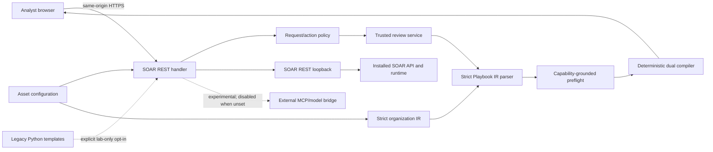

# Threat model

- **Scope:** SOAR Playbook Builder 2.27 development branch
- **Assessment date:** 2026-07-28
- **Release posture:** engineering alpha; trusted import and execution are locked

This model describes the security boundary we can test without a live Splunk
SOAR instance. It does not claim that SOAR authentication, authorization,
Visual Playbook Editor compatibility, import, or runtime execution has been
qualified.

## System and trust boundaries

The browser, asset configuration, organization templates, model output, bridge,
SOAR REST responses, and archive being installed are untrusted inputs. The
capability index is evidence only when it was harvested successfully from the
current installation and is fresh. Bundled baseline metadata is never treated
as installation proof.

## Assets to protect

- SOAR credentials, session cookies, REST tokens, and connector secrets;
- case, artifact, notable, and analyst data;
- playbook source, IR, compiled artifacts, and approval provenance;
- the integrity and availability of the capability index;
- target container, asset, and action selections;
- authorization/audit evidence;
- release source, dependency locks, archive, checksum, and SBOM.

## Threat and control register

| ID | Threat | Implemented offline control | Residual/live evidence |
|---|---|---|---|
| TM-01 | Unauthenticated or under-authorized mutation | Central action classification, POST-only mutation policy, origin/content-type checks, privacy-safe audit record | REST-handler principal and role signals must be proven on SOAR; authorization remains audit-only and trusted import stays disabled |
| TM-02 | Cross-user draft confusion or replay | Shared process-global draft state removed; trusted review is stateless and hash-addressed | Authenticated actor binding, idempotency, concurrent-user import, and replay tests require SOAR |
| TM-03 | Stored/reflected XSS or framing | Context-safe HTML bootstrap, React escaping, restrictive CSP, no inline scripts, frame denial, MIME/referrer/permissions headers, hostile-string tests | Validate headers through the actual SOAR proxy and supported browsers |
| TM-04 | Bridge SSRF, redirect abuse, or insecure transport | HTTP(S)-only parsing, HTTPS default, explicit lab-only HTTP switch, DNS/address policy, no redirects/proxies, bounded requests/responses | Approve bridge host/CA policy and test real DNS/network paths |
| TM-05 | SOAR loopback SSRF or credential forwarding | HTTP(S)-only base validation, no URL credentials/query/fragment, control-character-safe forwarded headers, verified TLS default, bounded response, method allowlist | Confirm supported internal base URLs, CA behavior, sessions, and Host handling on SOAR |
| TM-06 | Secret or traceback disclosure | Secret configuration type, permanent migration-export exclusion, response sanitizer, stable public errors/correlation IDs | Inspect real platform/app logs and proxy error pages |
| TM-07 | Model prompt injection, malformed output, or capability hallucination | Strict duplicate-safe JSON decoder, closed IR, authoritative provenance, bounded repair, no raw-output echo, exact capability preflight, sanitized terminal gaps | Qualify the weakest supported local model/runtime and adversarial prompt corpus |
| TM-08 | Executable organization template injection | Strict `custom_ir_templates_json` is the default; bounded parsing; exact ID binding; no executable fields; legacy Python ignored unless a lab switch is enabled and is visibly untrusted | Migrate any existing legacy org templates and keep compatibility disabled |
| TM-09 | Artifact drift or tampering | Canonical IR and report serialization, IR/review/compiler/artifact hashes, dual-artifact node parity and round-trip tests | Recompute and bind the same hashes to authenticated approval at import commit |
| TM-10 | Malicious or stale capability evidence | Schema/checksum validation, locked atomic write, last-known-good recovery, explicit harvest status/age/version gaps | Harvest real permissions, assets, objects, vocabularies, health, and supported API shapes |
| TM-11 | Archive traversal, links, hidden credentials, or nondeterminism | Reproducible normalized archive, one-root policy, no links/special files, path/size/mode controls, manifest and license requirements, SHA-256 | Clean installation and rollback on each supported SOAR version |
| TM-12 | Vulnerable or substituted dependencies/build actions | npm and Python lock constraints, advisory audits, full-history secret-scan CI, SHA-pinned GitHub Actions, Dependabot, SBOM and release checksums | CI must pass at the release revision; provenance signing remains a release improvement |
| TM-13 | Destructive or wrong-target execution | Typed prompt nodes, static fail-closed destructive metadata, exact target review, Import/Run locked in the trusted path | Live role enforcement, fresh confirmation, container binding, runtime assertions, audit, and rollback |
| TM-14 | Resource exhaustion | Request, JSON, model, response, template, IR, graph, retrieval, repair, package, and index bounds | Rate limiting and worker-level CPU/memory behavior require platform measurement |

## Security invariants

The trusted path must preserve all of these:

1. Models and users produce IR, never directly trusted executable Python.
2. No action, asset, parameter, output, permission, or object is assumed merely
   because it exists in bundled metadata.
3. A blocked preflight cannot become importable by a UI state change.
4. Review responses cannot be consumed by the legacy importer.
5. The same IR, capability-index version, report, compiler version, and artifact
   hashes must be revalidated at a future import commit.
6. Air-gapped mode does not silently substitute an egressing action.
7. Legacy Python templates and the legacy bridge path are never labeled trusted.
8. Public errors and audit records do not contain tokens, credentials, raw
   model output, full prompts, case content, or stack traces.

## Explicitly deferred live tests

- authenticated user and role extraction from the installed REST handler;
- authorization denial for viewer/analyst/admin roles;
- session/CSRF behavior through SOAR's proxy;
- live capability harvest and permission/object/asset-health evidence;
- native VPE JSON compatibility and visual parity;
- idempotent import, multi-user isolation, run targeting, cleanup, and rollback;
- actual playbook output and side effects for every support tier;
- zero-egress packet capture and bridge/CA/network policy;
- install, upgrade, restart, multi-worker, performance, and resilience evidence.

Any failure in these gates keeps trusted import and run disabled.
